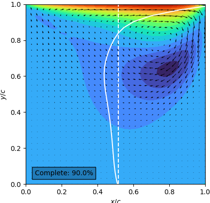
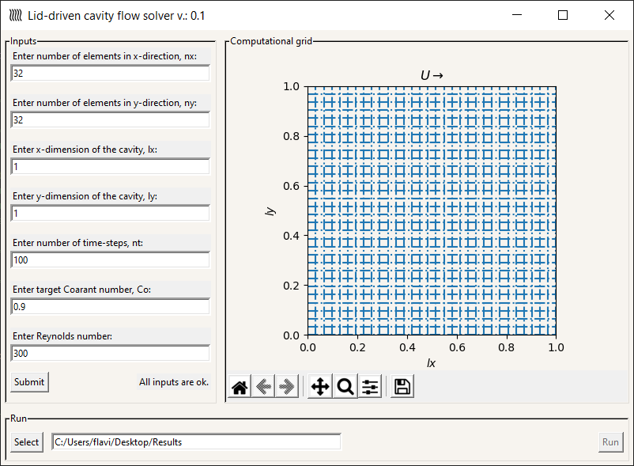

    
    
    
    
    
    
    

# lid-Driven Cativy flow solver

Computationally-efficient CFD solver with user interface written in Python.

- Very efficient solver for unsteady lid-Driven cavity flow for problems with grid-sizes of up to 256x256 nodes. 
- The pressure (Poisson) equation is efficiently solved using a 2-dimensional cosine transform based on the solver written by [Michio Inoue](https://github.com/mathworks/2D-Lid-Driven-Cavity-Flow-Incompressible-Navier-Stokes-Solver.git)

- The solver stores velocity and pressure fields for post-processing

## How to run:

The software contains a comprehensive UI that allows for parameters input and to pre-visualization of domain and grid sizing.

### Running a simulation:

Firstly, the user needs to input the following flow parameters:

- nx, ny: number of grid elements in x- and y-directions
- lx, ly: domain sizes in x- and y-directions
- nt: number of time-steps
- Co: target simulation's Coarant number (see )
- Re: target flow's Reynolds number. Reynolds number is based on cavity's x-dimension.

Secondly, the user has to select a directory to save the files under the Run console

Finally, the simulation can be started by clickin on "Run".

### If you don't have pip or git

For pip:

- Mac or Linux: install with `sudo easy_install pip` (Mac or Linux) - or (Linux) find a package called 'python-pip' in your package manager.
- Windows: [install Distribute then Pip](http://stackoverflow.com/a/12476379/992887) using the linked .MSI installers.

For git:

- Mac: install [Homebrew](http://mxcl.github.com/homebrew/) first, then `brew install git`.
- Windows or Linux: see [Installing Git](http://git-scm.com/book/en/Getting-Started-Installing-Git) from the _Pro Git_ book.

See the [wiki](https://github.com/fogleman/Minecraft/wiki) for this project to install Python, and other tips.

### Known issues:

- Selection of time-steps to save the data at is missing (currently, the software stores data at every 10 time-steps only).
- Real-time plotting of velocity and pressure fields (avoided at the current stage of development for improved computational performance). 

